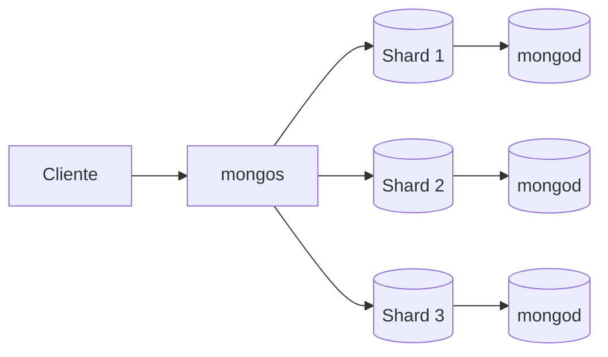

# Arquitetura do MongoDB

## Visão rápida

| Conceito | Papel |
| --- | --- |
| `mongod` | Processo que armazena e manipula os dados |
| `mongos` | Roteador de consultas em ambientes com sharding |
| Node | Instância individual do MongoDB |
| Replica set | Cópia dos mesmos dados em vários nodes |
| Sharding | Divisão dos dados entre vários servidores |
| Cluster | Conjunto de nodes trabalhando juntos |

## Mapa da arquitetura

## Visão geral

A arquitetura do MongoDB é baseada em processos, nodes e clusters. Isso permite distribuição de dados, alta disponibilidade e escalabilidade horizontal.

## Nodes

Nodes são as instâncias do MongoDB em execução em servidores diferentes ou no mesmo servidor, dependendo do ambiente. Cada node pode armazenar dados e participar da comunicação com outros nodes.

## mongod

O `mongod` é o processo principal do MongoDB. Ele é o daemon que armazena os dados, executa operações de leitura e escrita e gerencia o acesso aos documentos em um node.

## mongos

O `mongos` é o processo de roteamento usado em ambientes com sharding. Ele recebe as consultas do cliente e encaminha cada operação para o shard correto.

## Clusters

Um cluster é um conjunto de nodes que trabalham juntos para entregar disponibilidade, escalabilidade e distribuição de dados. Em MongoDB, um cluster pode ser baseado em replica set, em sharding ou em ambos.

## Replica set

Um replica set é um grupo de nodes que mantêm cópias dos mesmos dados. Normalmente existe um node primário, que recebe escritas, e um ou mais secundários, que replicam os dados.

## Sharding

Sharding é a divisão dos dados em partes menores, chamadas shards. Isso ajuda quando a base cresce muito e precisa ser distribuída entre vários servidores.

## MongoDB Atlas

MongoDB Atlas é o serviço gerenciado na nuvem da MongoDB.

Com o Atlas, você pode:

- Criar clusters sem cuidar da infraestrutura manualmente.
- Fazer backup e restauração.
- Usar monitoramento e métricas.
- Aplicar regras de segurança e controle de acesso.
- Conectar aplicativos com facilidade.

> Em prática, Atlas tira a parte chata da operação e deixa você focar no modelo e nas consultas.
