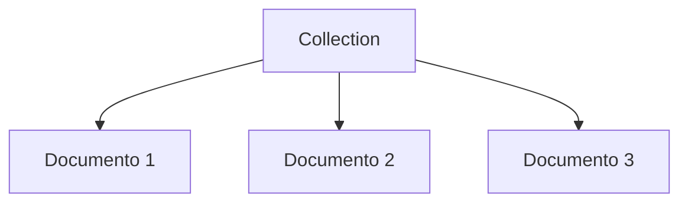

# Modelo de documento no MongoDB

> MongoDB troca a rigidez de tabelas por documentos flexíveis e bem mais próximos de estruturas reais de aplicação.

## Mapa mental

| Conceito | Ideia |
| --- | --- |
| Collection | agrupamento lógico |
| Document | unidade principal de armazenamento |
| JSON | formato de leitura humana |
| BSON | formato binário interno do MongoDB |
| Schema flexível | cada documento pode variar |

## Visão geral

O MongoDB organiza dados em coleções e documentos. A coleção é o agrupamento lógico, e o documento é a unidade principal de armazenamento.



## Estrutura flexível

Em MongoDB, cada documento pode ter campos diferentes. Isso reduz a dependência de migrações rígidas de schema.

Exemplo:

```json
{
	"nome": "Carlos",
	"email": "carlos@email.com"
}

{
	"nome": "Marina",
	"email": "marina@email.com",
	"telefone": "11999999999"
}
```

Isso é útil quando o domínio muda com frequência ou quando diferentes entidades compartilham uma coleção, mas com atributos extras diferentes.

## Modelagem prática

Em vez de pensar só em campos fixos, pense em:

- O que é comum entre os documentos.
- O que pode variar.
- O que deve ser aninhado em objetos.
- O que faz sentido virar array.

## JSON e BSON

MongoDB usa um formato inspirado em JSON para facilitar leitura e escrita, mas internamente trabalha com BSON.

### JSON

JSON é um formato textual, leve e fácil de ler por humanos e sistemas.

### BSON

BSON significa Binary JSON. É a representação binária usada pelo MongoDB para armazenar e transmitir documentos.

Vantagens do BSON:

- É mais eficiente para leitura e escrita interna.
- Suporta tipos extras além do JSON, como data, decimal, ObjectId e binário.
- Permite melhor desempenho em alguns cenários.

Exemplo de tipos que o BSON suporta melhor que o JSON puro:

- Data e hora.
- Identificadores únicos.
- Binários.
- Números com maior precisão.

## Quando usar BSON mentalmente

Você não escreve BSON manualmente no dia a dia, mas precisa saber que o MongoDB entende tipos que JSON puro não cobre com tanta naturalidade.

## Dados polimórficos

Dados polimórficos são documentos que compartilham uma base comum, mas podem ter variações de estrutura conforme o tipo ou o contexto.

Exemplo: uma coleção de veículos pode ter carros e motos.

```json
{
	"tipo": "carro",
	"marca": "Fiat",
	"portas": 4
}

{
	"tipo": "moto",
	"marca": "Honda",
	"cilindradas": 160
}
```

Esse modelo é comum em MongoDB porque a coleção não exige que todos os documentos tenham exatamente os mesmos campos.

## Exemplo de documento

```json
{
	"nome": "Ana",
	"idade": 28,
	"endereco": {
		"cidade": "Sao Paulo",
		"uf": "SP"
	},
	"habilidades": ["Python", "SQL", "MongoDB"]
}
```