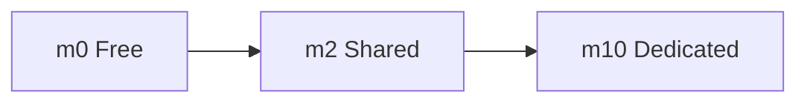

# Tiers de cluster no MongoDB Atlas

> Os tiers mostram o nível de recursos do cluster. Em Atlas, isso afeta performance, custo e recursos disponíveis.

## Visão geral

Os tiers mais comuns para começar são `m0`, `m2` e `m10`.

| Tier | Tipo | Ideia principal |
| --- | --- | --- |
| `m0` | Free tier | plano gratuito para estudo e testes |
| `m2` | Shared tier | ambiente pequeno e compartilhado |
| `m10` | Dedicated tier | cluster dedicado com mais controle |

## Mapa rápido

## m0

`m0` é o tier gratuito do MongoDB Atlas.

### Quando usar

- Estudos.
- Laboratórios.
- Projetos pequenos de teste.
- Validação inicial de aplicação.

### Pontos importantes

- Não é a melhor opção para produção.
- Tem limitações de recursos.
- É ótimo para aprender MongoDB Atlas sem custo.

## m2

`m2` é um tier compartilhado para cargas pequenas.

### Quando usar

- Testes leves.
- Aplicações pequenas.
- Ambientes de desenvolvimento que precisam de mais espaço que o free tier.

### Pontos importantes

- Compartilha recursos com outros usuários.
- Ainda tem limitações de performance e controle.
- Serve como passo intermediário entre o gratuito e um cluster dedicado.

## m10

`m10` já é um cluster dedicado.

### Quando usar

- Homologação mais séria.
- Projetos com uso real.
- Aplicações que precisam de melhor desempenho e previsibilidade.

### Pontos importantes

- Tem mais controle sobre capacidade.
- É mais adequado para produção do que `m0` e `m2`.
- Costuma ser o primeiro tier para sair do mundo de testes.
